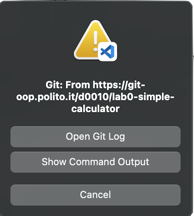
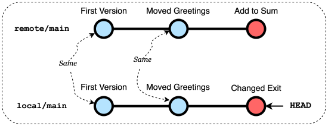

# Lab0 - Simple Calculator

The goal of this lab assignment is to learn basic usage of *git* operations.

All *git* operations described here can be performed either using the graphical UI or using the Command Line Interface (CLI) provided by a terminal.

## 1. Clone a repository using VSCode and git.

-  On GitLab click the blue "`Code`" button and then "`Clone with HTTPS`" to copy the link to the repository
    - if you are using VSCode installed on your computer you can click on `Visual Studio Code (HTTPS)`
-  In VSCode clone the repository:
    - In the welcome screen select "`Clone Git Repository...`" (You can use Welcome or Get Started in the Help menu to bring it on)
    - Enter the url of this repository: click the blue "`Code`" button and then "`Clone with HTTPS`" to copy the link
    - Select a location on the file system: `/vscode/workspace` (preserved in case of crash)
    - Enter username
    - Enter password
    - Confirm that you want to open the project

## 2. Build a console-based calculator application in Java 

-  In VSCode complete the code for the application
    - It must perform basic arithmetic operations: addition, subtraction, multiplication, and division
    - Most the code is already present in `Calculator.java`, the subtraction operation is missing

-  In VSCode, click on the Test button on the left 
    - Expand the contents until you find `TestCalculator.java`
    - Click on the run button &#x23F5; next to the file
    - If tests succeed a green cicled checkmark appears next to the tests
    - If any test fails a red circled X appears, read the message and fix the program.


## 3. Push all the files to the remote repository

-  In VSCode commit an push your code
    - Click the Source Control button  to open the Source Control panel
    - You will see the changes, including `Calculator.java` with an **M** on its right meaning that it has been modified
    - You can click on `Calculator.java` to open the differences editor
    - Add `Calculator.java` to the "Staged Changes" by clicking on the "`+`" next to it
            - CLI: `$ git add src/calc/Calculator.java`
    - Enter the commit message (e.g. "First Version") and click the "Commit" button
        - CLI: `$ git commit --message "First Version"`
        - Warning: if you forget to enter the commit message an editor is opened
          where you can enter the messagge, save it and click che checkmark at top right to proceed
    - Click in the `Sync Changes` (before it was *Commit*) to push the chnages to the remote repository
        - CLI: `$ git push`

-  On GitLab re-open (refresh) the web page with the remote repository
    - you will see at the top of the page a box with the latest commit you just pushed
    - Click on the message (e.g. "First Version") to see all the changes in the commit

## 4. Make a change using GitLab web interface

-  On GitLab, in the repository, move the print of "Simple Calculator" before the loop and commit the change:
    - Go back to the main page of the project
    - Open the `src/calc` folder
    - Click on the `Calculator.java` file
    - Click on the blue `Edit` button and select `Edit single file` to start editing the file
    - Make the change in the editor area:  move the print of "Simple Calculator" before the loop
    - Write commit message  "Moved Greeting"
    - Click on `Commit`

## 5. Update the local repository with a Pull

-  In VSCode synchronize the changes:
    - click on the `...` that appear when you move the pointer on the "SOURCE CONTROL" (the lower one)
    - Select `Pull`
         - CLI: `$ git pull`
        
        This operation will update the working copy contents with the new remote changes
    - Check in the editor windows that `Calculator.java` now contains the changed code

**Comment**: this is the procedure you should carry on every time before you start working, to make sure you have in your working copy the latest changes.


## 6. Perform two concurrent modifications in GitLab and in VSCode

We simulate what happens when two developer make changes at the same time (on the same file).

-  On GitLab, change `"Add"` menu item into `"Sum"` and commit with message "*Add to Sum*"

-  In VSCode, change the value of constant `EXIT` to `0` and update the prompt string `(1-5)` becomes `(0-4)`  
    - Commit with message "*Changed exit*"
        - CLI  `$ git commit -a --message "Changed exit"`
    - Click on `Sync Changes` (push)
        - CLI: `$ git push`
    
        VSCode notifies an error:

        
    
    - click on `Show Command Output` button an you will see the message

    ```
    ...
    hint: Updates were rejected because the remote contains work that you do
    hint: not have locally. This is usually caused by another repository pushing
    hint: to the same ref. You may want to first integrate the remote changes
    hint: (e.g., 'git pull ...') before pushing again.
    ```


## 7. Solve divergent commits with Rebase

The two concurrent commits brough the repositories, remote and local, the the condition described by the following commit graphs:



The push was refused because the the local repo and the remote diverged after the `("Moved Greeting")` commit.


-  In VSCode update le working copy

    - Open the Source Control panel click on the "..." (dots) and then `Pull`
        - GIT `$ git pull`
    
        the command generated an error and the command output will tell you

        ```
        ...
        hint: You have divergent branches and need to specify how to reconcile them.
        hint: You can do so by running one of the following commands sometime before
        hint: your next pull:
        ...
        ```

    The Pull (Fetch + Checkout) failed since two commits are candidate to become HEAD of the main branch, only the Fetch part is performed, the current repository contains two divergent commits

    

    The simplest option to solve the problem is to "Rebase" the local commits after the remote commits

-  In VSCode perform a rebase
    - Open the Source Control panel click on the "..." (dots), `Pull, Push` and then `Pull (Rebase)`
        - CLI: `git pull --rebase`

    After the rebase, the current repository contains a single thread of commits

    

    Now you have 1 commit (the "Changed Exit") *rebased* after the remote one ("Add to Sum").

    Git automatically combined the changes in the local commit so that they are applied in sequence
    after those of the remote commit

-  In VSCode synchronize the changes
    - Click on the `Sync Changes` button in the Source Control panel
        - CLI: `git push`

-  On GitLab re-open (refresh) the web page with the remote repository and check that al changes are now present there


## 8. Perform two concurrent conflicting commits

We simulate what happens when two developers concurrently make commits that affect the same lines in a file. In this case git is not able to automatically combine the changes.

-  On GitLab, change the two `"Enter ... number"` into `"Plase, enter ... number"` and commit with message "*Be kind*"

-  In VSCode, 
    - change the two `"Enter ... number"` into `"Enter ... operand"` 
    - commit with message "*Be formal*"
        - CLI  `$ git commit -a --message "Be Formal"`

    - In Source Control panel click on `Sync Changes` or (`Pull`)
        - CLI `$ git pull`
        
        the command generates an error as in the previous case due to diverging commits
    - Click on `Cancel` to dismiss the dialog

The local repository contains


## 9. Solve conflicting commits 

-  In VSCode 
    - In the Source Control panel click on the "..." (dots), `Pull, Push` and then `Pull (Rebase)`
        - GIT `$ git pull --rebase`    
        
        You get an error message as before  

        This is due to the fact the two changes are conflicting (they are on the same lines) and git is not able to automatically reconcile them
    
    - In the Source Control tab there is a "*Merge Changes*" section where are listed all the files 
      with conflicting changes (`Calculator.java`) higlighted in red with a `!` on the right
    
    - Click on `Show Changes` or open `Calculator.java` to see che conflicting changes
        - in this window you see the conflics, surrounded by `<<<<<<< HEAD` and `>>>>>>> ... (Be formal)`:

        ```
        ...
        <<<<<<< HEAD
            out.print("Please, enter first number: ");
            num1 = scanner.nextDouble();
            out.print("Please, enter second number: ");
        =======
            out.print("Enter first operand: ");
            num1 = scanner.nextDouble();
            out.print("Enter second operand: ");
        >>>>>>> 79add5b (Be formal)        
        ...
        ```
                
        - Solve the conflict by editing the code to combine the changes and removing the conlict markers, e.g. as:

        ```
        ...
            out.print("Please, enter first operand: ");
            num1 = scanner.nextDouble();
            out.print("Please, enter second operand: ");
            num2 = scanner.nextDouble();
        ...
        ```

    - Click in the `+` on the right of the modified file to add it to the commit that resolves the conflicts
        - CLI `$ git add src/calc/Calculator.java`

    - Click on `Continue` in the Source Control pane to complete the rebase operation.
        - CLI `$ git rebase --continue --message "Be Formal"`

      Now the local repository contains

      

    - Synchronize the changes by clicking on `Sync Changes`
        - CLI `$ git push`

-  On GitLab, in the left menu select `Code` and the `Respository graph`
    - you will se the commit graph of the repository

---
V 2.0.0.
